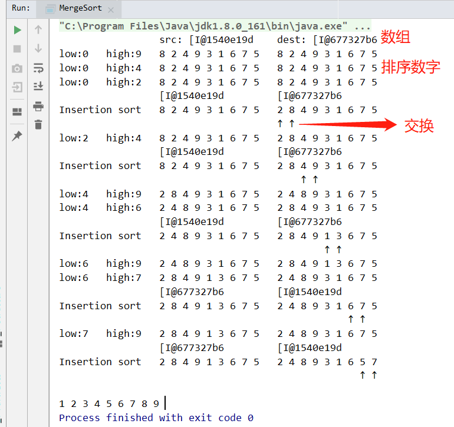

# algorithm
记录一些算法题的解法，以及Java中一些基础原理的实测

# 目录结构
* base                  Java基础类、工具的使用与实测
* sort                  基础排序
* linear                线性结构
* thread                线程相关
* tree                  树型结构
 剩下的是未归类的

> 举个例子，比如合并排序，这里对排序过程进行了输出。
> 当递归方法内长度小于3时，就进行Insertion sort，以下按方法执行顺序输出：
> 