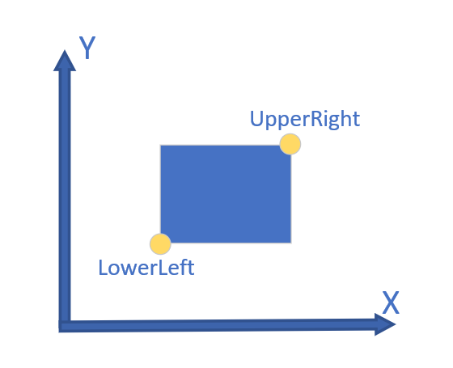

# PDF 生成以及加签

尝试过两种软件，Spire我用了免费的，效果不太好，推荐使用Itext5，也是免费的：
### Spire
> [免费](https://www.e-iceblue.cn/Introduce/Spire-PDF-JAVA.html) & [收费](https://www.e-iceblue.cn/Introduce/Free-Spire-PDF-JAVA.html)
### Itext5
> [参考代码](https://itextpdf.com/en/resources/examples/itext-5-legacy) & [Java Doc](https://api.itextpdf.com/iText5/5.5.9/)
* Itext坐标系
 </img>

### PDF语法参考
:point_right:[PDF官方文档](https://www.adobe.com/content/dam/acom/en/devnet/pdf/pdfs/pdf_reference_archives/PDFReference.pdf)（将近1000页:expressionless:有时间的大佬可以研究研究）
:point_right:[入门博客](https://gendignoux.com/blog/2016/10/04/pdf-basics.html)
因需要绘制PDF，所以需要获取模板内容（具体参数）进行分析。在itext5中使用以下语法获取内容：
```
PdfReader reader = new PdfReader(SRC_PDF);
byte[] streamBytes = reader.getPageContent(1);
String contentStream = new String(streamBytes);
System.out.println(contentStream);
```
结果类似这种：
```
BT
/CS0 cs 0.6 0.4 0  scn
/C2_0 56.25 Tf
700.312 1203.75 Td
<0003000400050006000700080009000A000B0008000C>Tj
ET
/TouchUp_TextEdit MP
BT
/C2_0 22.5 Tf
135 1067.907 Td
<000D000C000E000F00100001>Tj
0 -27 TD
......
```
